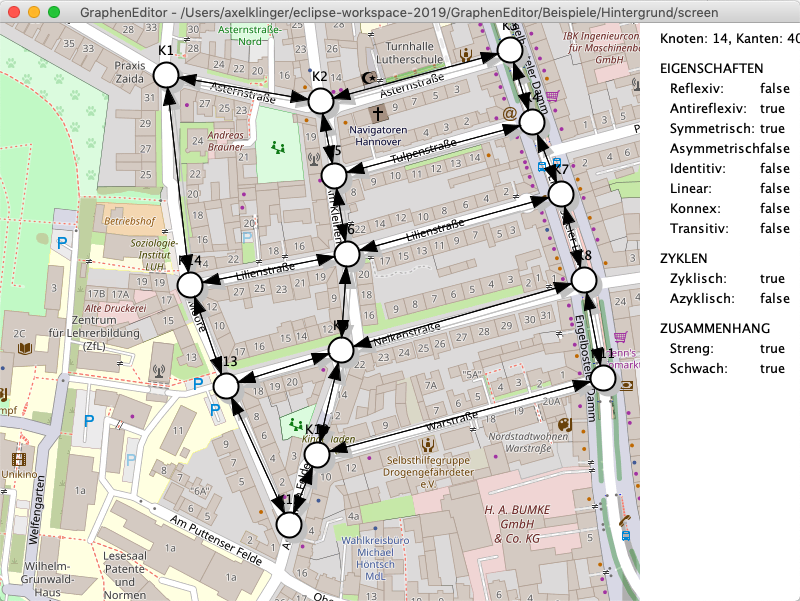

# GraphenEditor

Einfacher Editor für die Darstellung und Analyse von Graphen.

Anforderung JDK 1.5+

**Anwendung**

1. import in eclipse
2. run grapheneditor.GraphenEditorLight

**Steuerung**

	F1  Diese Hilfe
	C   Schwache Zusammenhangskomponenten
	D   Struktureigenschaften
	E   Kantendisjunkte Wege (a,b)
	F   Fang
	I   Füllfarbe wählen (auswahl)
	L   Linienfarbe wählen (auswahl)
	N   Knotendisjunkte Wege (a,b)
	T   Topologisch sortieren
	P   Pseudostrenge Zusammenhangskomponenten
	R   Ansicht Raster
	X   Ansicht Schatten
	RECHTS  Nächste Ansicht
	LINKS   Letzte Ansicht
	HOCH    Nächster Modus
	RUNTER  Letzter Modus
	ESCAPE  Farben zurücksetzen\n
	
	Strg + N   Neuer Graph
	Strg + O   Graph öffnen
	Strg + S   Graph speichern
	Strg + U   Graph speichern unter ...
	Strg + G   Graph als SVG exportieren
	Strg + X   Graph als JPG exportieren
	Strg + H   Hintergrundbild laden\n
	
	Alt + RUNTER Ansicht zurück
	Alt + HOCH   Ansicht vor
	Alt + H      Hintergrundbild anzeigen
	Alt + F4     GraphenEditor beenden
